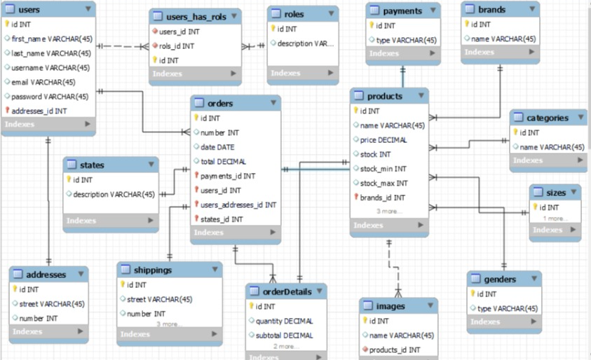

# Sequelize ORM tutorial - Models and Relational Databases

This project is used as a follow through for learning sequelize ORM and object mapping from models to relational databases

[Sequelize ORM Documentation](https://sequelize.org/master/)

#### Video lessons:

[Lesson 1](https://drive.google.com/file/d/1lpKHwuwbRji0lF4mPTIxSBdf83AtkKOL/view)

[Lesson 2](https://drive.google.com/file/d/16HNXrSqS5B5g72pXemGtt1akEZ2coTmJ/view)

[Lesson 3](https://drive.google.com/file/d/1s2FStbqSgLakE0eYN7k4ymjly8dYWnTU/view)

[Lesson 4](https://drive.google.com/file/d/1UJIsKReaMKoHvM5HkVnMuDQXbA8aN-Ix/view)

#### ERD Diagram 
*(hypothetically provided by some analyst)*

[Sequelize Object Relationship Modeling](https://sequelize.org/master/manual/assocs.html)

#### Notes:

- migrations create the tables with uppercased first letters which you should alter from the sequelize commands if you so desire.

- sequelize can also create all the folder scaffolds if needed. you dont have to manually do that if you already know what you are doing.

